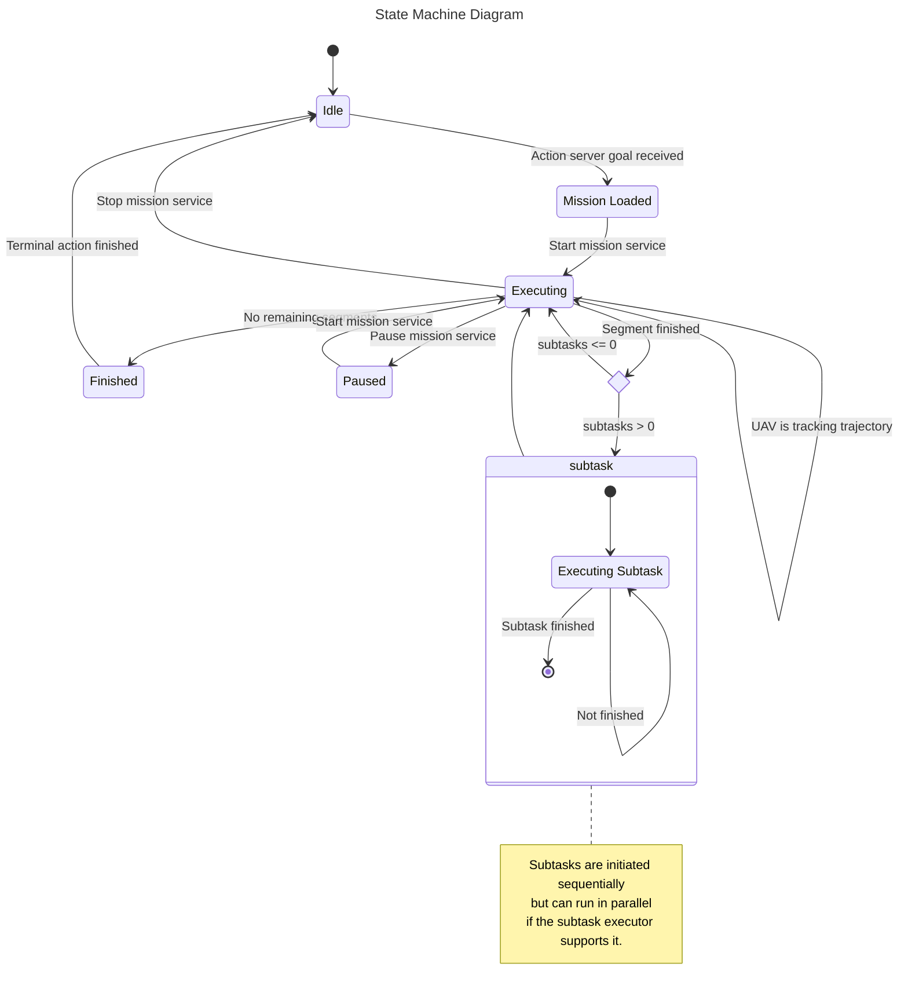

# iroc_mission_handler

ROS 2 action server that handles single-robot mission execution. It accepts a waypoint sequence, generates trajectories, sends them to the flight controller, and manages the full lifecycle of a mission including takeoff, segment-by-segment execution, subtask dispatch at each waypoint, and terminal actions (land / return-to-home).

---

## System Position

```
iroc_fleet_manager          (fleet coordinator)
       │
       │  ExecuteMission action
       ▼
iroc_mission_handler        (per-robot mission executor)
       │
       ├── mrs_msgs services  (trajectory / path / reference)
       ├── takeoff / land / hover services
       └── subtask plugin system
```

---

## State Machine

The mission handler drives a state machine through the stages shown below. Subtasks at each waypoint are managed by a separate `SubtaskManager` that runs them sequentially or in parallel depending on the `parallel_execution` flag.


```mermaid
---
title: State Machine Diagram
---
stateDiagram-v2
  [*] --> Idle
  Idle --> ML: Action server goal received
  ML --> Executing: Start mission service

  Finished --> Idle: Terminal action finished
  Executing --> Finished: No remaining segments

  Executing --> Paused: Pause mission service
  Paused --> Executing: Start mission service
  Executing --> Idle: Stop mission service
  Executing --> Executing: UAV is tracking trajectory

  state if_state <<choice>>
  Executing --> if_state: Segment finished
  if_state --> Executing: subtasks <= 0
  if_state --> subtask: subtasks > 0

  state subtask {
    [*] --> ST
    ST --> [*]: Subtask finished
    ST --> ST: Not finished
  }
  note right of subtask: Subtasks are initiated sequentially<br>but can run in parallel<br>if the subtask executor supports it.
  subtask --> Executing

  ML: Mission Loaded
  ST: Executing Subtask
```

### State Descriptions

| State | Meaning |
|---|---|
| **Idle** | No mission loaded. Waiting for an action goal. |
| **Mission Loaded** | Goal accepted and trajectories generated. Waiting for a start service call. |
| **Executing** | UAV is actively tracking a trajectory segment. |
| **Paused** | Execution suspended; UAV is hovering. Resumes on start service call. |
| **Finished** | All waypoints visited. Terminal action (land / RTH) in progress before returning to Idle. |

---

## ROS Interfaces

### Action Server

| Name | Type | Description |
|---|---|---|
| `mission_handler` | `iroc_mission_handler/action/Mission` | Main entry point — accepts a mission goal, streams feedback, and returns a result. |

**Goal fields** (`MissionGoal`):

| Field | Type | Values |
|---|---|---|
| `name` | `string` | Human-readable mission name |
| `frame_id` | `uint8` | `0` LOCAL · `1` LATLON · `2` FCU |
| `height_id` | `uint8` | `0` AGL · `1` AMSL · `2` FCU |
| `points` | `Waypoint[]` | Ordered waypoint list |
| `terminal_action` | `uint8` | `0` NONE · `1` LAND · `2` RTH |

**Feedback fields** (`MissionFeedback`):

| Field | Type | Description |
|---|---|---|
| `name` | `string` | Mission name |
| `message` | `string` | Human-readable status |
| `goal_idx` | `uint16` | Current waypoint index |
| `distance_to_closest_goal` | `float64` | Distance to the current waypoint (m) |
| `goal_estimated_arrival_time` | `float64` | ETA to current waypoint (s) |
| `goal_progress` | `float64` | Progress toward current waypoint (0–100 %) |
| `distance_to_finish` | `float64` | Total remaining distance (m) |
| `finish_estimated_arrival_time` | `float64` | ETA to mission end (s) |
| `mission_progress` | `float64` | Overall mission progress (0–100 %) |

**Result fields** (`MissionResult`):

| Field | Type | Description |
|---|---|---|
| `name` | `string` | Mission name |
| `success` | `bool` | `true` if all waypoints were reached |
| `message` | `string` | Completion or failure reason |

---

### Service Servers

| Name | Type | Description |
|---|---|---|
| `~/svs_upload_mission_out` | `iroc_mission_handler/srv/UploadMissionSrv` | Pre-validate and stage a mission before execution. Request contains `MissionGoal`; response has `success` + `message`. |
| `~/svs_unload_mission_out` | `iroc_mission_handler/srv/UnloadMissionSrv` | Remove the currently staged mission. |
| `~/svs_mission_activation_out` | `std_srvs/srv/Trigger` | Resume a paused mission. |
| `~/svs_mission_pausing_out` | `std_srvs/srv/Trigger` | Pause an executing mission. |

---

### Service Clients

**UAV flight control:**

| Name | Type | When called |
|---|---|---|
| `~/svc_takeoff_in` | `std_srvs/srv/Trigger` | Before mission start if UAV is on the ground |
| `~/svc_hover_in` | `std_srvs/srv/Trigger` | On pause |
| `~/svc_land_in` | `std_srvs/srv/Trigger` | Terminal action LAND |
| `~/svc_land_home_in` | `std_srvs/srv/Trigger` | Terminal action RTH |

**Mission execution:**

| Name | Type | When called |
|---|---|---|
| `~/svc_mission_start_in` | `std_srvs/srv/Trigger` | To begin tracking a loaded trajectory |
| `~/svc_mission_pause_in` | `std_srvs/srv/Trigger` | To pause trajectory tracking |
| `~/svc_mission_flying_to_start_in` | `std_srvs/srv/Trigger` | To fly to the first waypoint |

**Trajectory and reference management:**

| Name | Type | When called |
|---|---|---|
| `~/svc_trajectory_reference_in` | `mrs_msgs/srv/TrajectoryReferenceSrv` | To load a new trajectory segment |
| `~/svc_path_in` | `mrs_msgs/srv/PathSrv` | To send a path to the controller |
| `~/svc_get_path_in` | `mrs_msgs/srv/GetPathSrv` | To retrieve the current path |
| `~/svc_transform_reference_in` | `mrs_msgs/srv/TransformReferenceSrv` | To transform a single reference |
| `~/svc_transform_reference_array_in` | `mrs_msgs/srv/TransformReferenceArraySrv` | To transform a reference array |
| `~/svc_mission_validation_in` | `mrs_msgs/srv/ValidateReferenceArray` | To validate waypoints against safety constraints |

---

### Subscribers

| Topic | Type | Description |
|---|---|---|
| `~/uav_state_in` | `mrs_msgs/msg/State` | Current UAV state (armed, flying, landed, etc.) — drives state-machine transitions |
| `~/control_manager_diagnostics_in` | `mrs_msgs/msg/ControlManagerDiagnostics` | Tracker status and goal info — used to detect waypoint completion |

---

## Subtask Plugin System

When a UAV reaches a waypoint, the `SubtaskManager` runs any subtasks defined for that point before advancing to the next one. Subtasks are loaded via `pluginlib` at runtime.

### Plugin Interface

All subtask executors inherit from `SubtaskExecutor` and must implement:

```cpp
// Called once when the subtask is loaded
virtual bool initializeImpl(rclcpp::Node::SharedPtr node,
                             const std::string &parameters) = 0;

// Called when the waypoint is reached
virtual bool startImpl() = 0;

// Polled on every timer tick; set progress 0–100
virtual bool checkCompletion(double &progress) = 0;

// Called on mission stop/cancel
virtual bool stop() = 0;
```

### Built-in Executors

| Plugin name | Address | Parameters | Description |
|---|---|---|---|
| `wait` | `iroc_mission_handler/WaitSubtaskExecutor` | Floating-point seconds (e.g. `5.0`) | Holds position for the specified duration |
| `gazebo_gimbal` | `iroc_mission_handler/GazeboGimbalSubtaskExecutor` | `[roll, pitch, yaw]` in radians | Orients the simulated gimbal camera |

### Adding a Custom Executor

1. Create a class that inherits `SubtaskExecutor` and implement the four virtual methods.
2. Register it with pluginlib in your package's `plugins.xml`.
3. Add the plugin name to `subtask_manager/available_executors` in `config.yaml` and provide the address under `executors:`.

---

## Configuration

**File:** `config/config.yaml`

```yaml
mission_handler:
  main_timer_rate: 100.0    # [Hz] state-machine polling rate
  feedback_timer_rate: 1.0  # [Hz] action feedback publish rate
  takeoff_timeout: 30.0     # [s]  max time to wait for hover after takeoff
  subtask_manager:
    available_executors:
      - wait
      - gazebo_gimbal
    executors:
      wait:
        address: "iroc_mission_handler/WaitSubtaskExecutor"
      gazebo_gimbal:
        address: "iroc_mission_handler/GazeboGimbalSubtaskExecutor"
```

| Parameter | Type | Description |
|---|---|---|
| `main_timer_rate` | `float` (Hz) | How often the state machine runs. Higher = more responsive transitions. |
| `feedback_timer_rate` | `float` (Hz) | How often action feedback is published to the fleet manager. |
| `takeoff_timeout` | `float` (s) | If the UAV has not reached hover within this time after a takeoff call, the mission is aborted. |
| `subtask_manager/available_executors` | `string[]` | Short names of executor plugins that may appear in mission goals. |
| `subtask_manager/executors/<name>/address` | `string` | Fully qualified pluginlib class address for each executor. |
