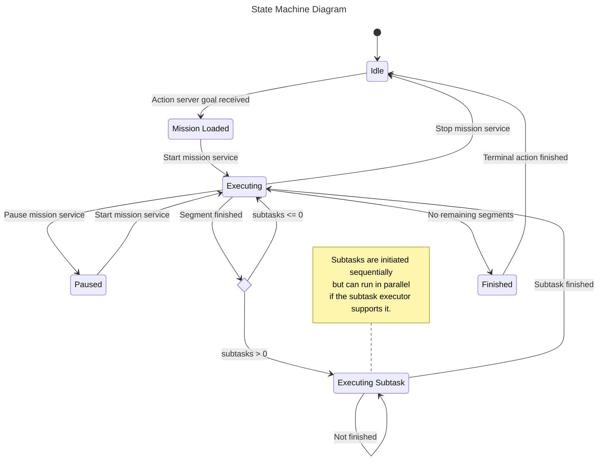

# iroc_mission_handler

ROS (Robot Operating System) action server component that implements drone flight control. Specifically, it handles requests to navigate a drone through a defined sequence of waypoints. It allows users to define a series of waypoints and then controls the drone to visit each point in order.

## State machine

The state machine for the iroc_mission_handler is designed to manage the drone's flight path through a series of waypoints but taking into account the subtasks involved in reaching each trajectory final point.

